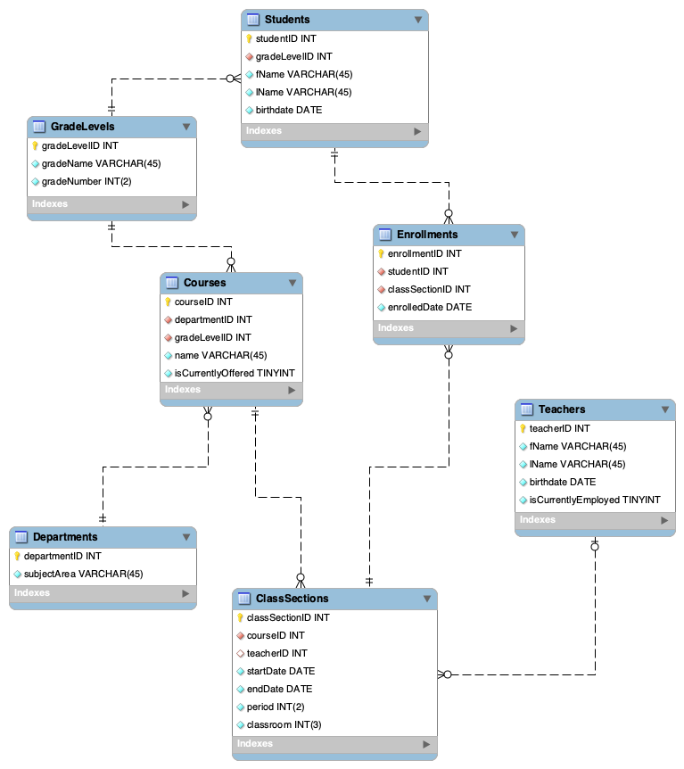

# Beaver High School Class Enrollments Web Application

Below is a description of how to install, configure, and use this web application. It utilizes a MySQL database
for data storage and manipulation, and uses Python's Flask library to interface and interact with said database.
This app was developed by Conrad Schreiner and Iris Schwartz as the final project for CS340 Intro to
Databases at Oregon State University. The project is uses the standard Flask file and directory structure. The templates contains
all of the html style Jinja templates which are used to render the web pages of the application using Flask. The static directory contains both the main.css in a folder titled css, and the images folder contains an image of the database schema model. The database directory houses the sql_storage folder where the DDL.sql, DML.sql and invidual SQL file used for CRUD operations are stored. In the root of the project directory, app.py is the primary file that runs the application, containing the database connection configuration and CRUD operations for interacting with the database. There are also two custom Python files in the root directory that were written by Conrad and are used within app.py. The requirements.txt, which is used to document the required Python libraries is stored in the root of the project as well as the .gitignore file that is used to excluded specific files and folders from git (such as the virtual envirnonment .venv, the .env, IDE cached files, etc.)

## Citation
This app was largely adapted from the [osu-cs340-ecampus /flask-starter-app](https://github.com/osu-cs340-ecampus/flask-starter-app)
GitHub repository that was provided by the TA's. Even though we borrowed much from the starter app,
a large portion of this project was developed organically by our team. For example, we dropped the `db_connector.py` file completely and instead opted for configuring the connecting in app.py via the `app.config` rows and the following functions
which were written by Conrad to stream line the process of calling `mysql.connection.cursor()` to run SQL queries. 
It should also be noted that this GitHub repository was used for reference while writing this readme documentation: [markdown-cheatsheet](https://github.com/im-luka/markdown-cheatsheet).
Unless otherwise noted, the SQL queries were written by our team - often using the official MySQL documentation for reference: [MySQL 9.2 Reference Manual Chapter 15 SQL Statements](https://dev.mysql.com/doc/refman/9.2/en/sql-statements.html).
All for the webpages use Jinja templates that are rendered via the Flask library. These templates were adapted from both the [osu-cs340-ecampus /flask-starter-app](https://github.com/osu-cs340-ecampus/flask-starter-app),the official [Jinja template decoumenation](https://jinja.palletsprojects.com/en/stable/templates/), and the official 
[Flask documentation](https://flask.palletsprojects.com/en/stable/). 

## Table of Contents

- [Installation and Configuration](#installation-and-configuration)

  - [Pre-step Clone the Repository](#pre-step-clone-the-repository)

  - [Classwork server method](#1a-classwork-server-method)

  - [Local MySQL method on Windows](#1b-local-mysql-method-on-windows)

  - [Local MySQL on MacOS](#1c-local-mysql-on-macos)

- [Install Python virtual environment, libraries and the .env file for the database connection](#2-install-python-virtual-environment-libraries-and-the-env-file-for-the-database-connection)

- [Navigating the Website](#navigating-the-website)

  - [Home Page](#home-page)

  - [Grade Levels Page](#grade-levels-page)

  - [Students Page](#students-page)

  - [Teachers Page](#teachers-page)

  - [Departments Page](#departments-page)

  - [Courses Page](#courses-page)

  - [Class Sections Page](#class-sections-page)

  - [Enrollments Page](#enrollments-page)

- [Database Schema Diagram](#database-schema-diagram)

- [Potential F.A.Q.](#potential-faq)

### Installation and Configuration

There are two ways to install and configure this app: via a connection to a database on the oregon state
engineering departments classwork server, or via a connection to a locally installed MySQL database.
Note that the classwork server uses a MariaDB database, so the SQL syntax can be slightly different
(such as the table names beginning defaulted to all lower case in MySQL).

### Pre-step Clone the Repository

- This step can be straightforward or a little complicated depending on your level of git experience. I have found that it is easiest to do via the command line, in an IDE
    where you are logged into your GitHub account.
- If you decide to go with the classwork server method then I recommend Visual Studio Code using the remote explorer extension.
    Login with your credentials or using a ssh key configuration. Once successfully logged in, cd to the directory of your choosing, then run the following commands:
    1. `git init` (git should already be installed on the class server)
    2. `git clone https://github.com/conradschreiner/BHSClassEnrollmentsFlaskApp.git`
- The BHSClassEnrollmentsFlaskApp repository should now be populated in you current working directory.
- If you go with the local database install, then I recommend PyCharm. If you are an OSU student (or any other college student really) then you should have access
    to the GitHub Student Developer Pack, which contains PyCharm Professional. The pro version has many more tools compared to the free community version, and I highly
    recommend using it because it make life so much easier. I've tried remote development on the classwork server using PyCharm as well, but the remote capability
    is still in beta and noticed that it has a good deal of lag compared to remote work on VS Code. You will also need to ensure that you have Python installed locally.
    I used Python 3.12 locally and 3.9 on the osu class server (because that is the version installed on the class server) and experience no issues running
    my code from either location. From my understanding most 3.0 and above are backwards compatible with everything Python3 but not Python2
    (Python 2 is quite old now and I'm pretty sure has been retired by the Python Foundation, so please don't use Python 2).
- For the next step on the local PyCharm install, there are two options (also ensure that you have git installed locally):
    1. Standard git clone. Click file -> Project from Version Control... fill in the url with the provided GitHub repo url.
        Then select wherever you would like the app repo to be stored. The default PyCharmProjects folder is fine, or you can
        create your own if you prefer.This will clone the repo into your choosen directory. (it should prompt you to create a Python virtual environment .venv, if so agree.)
    2. Alternatively, you can Click file -> New Project... and if using PyCharm Pro, select Flask on the left had side. This will automatically create a structured,
        blank Flask project repository for you, with the standard folder structure and the option the create a virtural environment for you as well. From there,
        you can copy all the associated files from the BHSClassEnrollmentsFlaskApp GitHub into your "blank" Flask repository. This means that you won't be directly linked
        to the remote git repo automically, but considering this project is closed and not accepting any new collaborators that is fine. If you have issues getting Flask
        installed properly in the later Python section, then I would recommend going with this option.

### 1a. Classwork server method

- Follow the instructions provided in Module 1 of the OSU Intro to Databases course to initialize your MariaDB database
- Open mysql client from the command line, or alternatively log into PHPmyAdmin.
- On the DDL file itself, refactor "USE cs340_username" to your OSU login.
- Run the provided DDL file to populate the database. If successful you should be able to run "SHOW TABLES;" and the App's database tables will be displayed.
    if you experience any errors, ensure that the DDL is configured to your username and that you have commented out the "CREATE SCHEMA" lines of SQL.
- Test that the database has been successfully populated by running some basic queries, such as `SELECT * FROM Students;` and/or `SELECT * FROM Courses;`, etc.
- If the queries return data, then you should be all set and have successfully completed this step.

### 1b. Local MySQL method on Windows

- If you would prefer to run the app locally instead of on the class server then start with installing MySQL from the official MySQL website.
  - I would recommend installing the package that also contains MySQL Workbench, it makes getting everything up and running much easier.

- After successfully installing MySQL, follow the instructions on creatiing both the localhost root login, and he admin level login. You can create more users if you would like but that is not necessary for running this application. I recommend saving both the root and admin logins to your favorite password manager (such as Bitwarden).

- You can configure the local MySQL instance to run on startup, or you can configure it to run adhoc via the Windows Services application.
  - I (Conrad) went with the adhoc method because I did not want MySQL constently running and taking up processing power and RAM on my desktop while
        I wasn't working on the app. It may seem intimidating running MySQL as a service but it shouldn't be! All you have to do is click on the Windows
        search bar, type in sevices (it should have a gear icon) then click the Services application, you have have to run as an admin. Then scroll down
        the list of services until you find MySQL, click on it which should highlight it, then click the green sideways triangle in the top bar of the window, it looks like a play button. Doing this will start up you MySQL localhost as a service and be accessible has a database host.
- From here, the next step is running the DDL file. Unless you have another preferred method I would recommend using MySQL Workbench. There is documentation
        on the MySQL handbook / reference guide on confiiguring a localhost connection
         but I will explain briefly here as well. Essentially you need to create a new
        database connection, then fill in the connection parameters with the login details that you configured with the MySQL installation. I believe it is best practice to
        use the admin login for this as opposed to the root. So, fill in host as localhost, username as your admin username, and password as your admin password.
        Choose any port number you like, I chose 3306 which if I recall was the default port that MySQL workbench provided.

- Now you should be able to successfully connect to localhost. It should be empty with no Schemas created yet.

- After connection to localhost with your admin login, open up the DDL.sql file from the database directory in the repository. Refactor the code to use the "CREATE SCHEMA;" row instead of the "USE cs340_schrecon" row. You can use the provided Schema name, or change it to something else, it does not matter.

- Now run the DDL file in MySQL Workbench. After successful execution, refresh the Schema viewer on the lefthand side of Workbench. You should now see the schema
        that you just created with the DDL.sql file. From the schema viewer you can view the tables in the newly created database, column information, foreign and primary
        key references, and more.
- Locally the database side of the app is now all ready.

### 1c. Local MySQL on MacOS

- I was not able to get a local MySQL installed on my MacBook. It appears that Windows is the only option for a local MySQL installation.

### 2. Install Python virtual environment, libraries and the .env file for the database connection

This step will differ depending on your installation method.

### For the classwork server

- Addtional context and instructions can be found here on the flask-starter-app repo: [Flask Starter App Step 2 Preperation](https://github.com/osu-cs340-ecampus/flask-starter-app#step-2---preparation)

1. In the terminal, ensure that your current working directory is the location where you cloned the GitHub repository.

2. In the directory where you cloned the repo, create a Python virtual environment (.venv) using the following command `python -m venv ./venv`
    - The starter app mentiones using `python3` and `pip3` but when running commands but I have found that is not necessary if your only version of Python installed is Python 3.0 and above (no Python 2)

3. Initialize the .venv and open it in the terminal via this command - source .venv/bin/activate

4. via pip, install all of the libraries found in the requirements.txt file (sometimes the IDE will prompt you to install these automatically).

5. Next, create a .env file to store your database credentials that app.py can use to connect to your Schema on the classwork server.

    ```plaintext
    host=classmysqlurl
    user=cs340_username
    passwd=your_password
    db=cs340_username
    ```

6. If everything installed correctly you should be good to go - to run the app you can either click the "run"
    button at the top right of the VS Code window. You can also run it as main via the command line - python app.py.
    Lastly, if you would like the website to be accessed by others, run it on the class server via gunicorn:
    gunicorn --bind 0.0.0.0:4706 wsgi:app (pick whatever port you would like). To shutdown the server type: command c on MacOS
    (or linux I assume?) or if on Windows ctrl c.
    I recommend NOT using the -D parameter at the end of the gunicorn statement as described in the flask-starter-app.
    That command will toggle the app to run indefinitely and closing it out is a bit more of a process compared to
    the regular gunicorn instance - running a grep command and then a kill command on the associated port that the app is
    running on.
7. Now you should be all set! After running gunicorn or python app.py, you should be able to open the website in your
    browser of choice and navigate through the pages and run SQL against the database via the UI.

### For the local install if you went with a standard "clone and go" approach

1. If IDE did not automatically create it for you - in the directory where you cloned the repo, create a Python virtual environment (.venv)
    using the following command -
2. Initialize the .venv and open it in the terminal via this command - source .venv/bin/activate - you may should be able to open a terminal instance
    of the venv whether using PyCharm or VS Code
3. via pip, install all of the libraries found in the requirements.txt file (sometimes the IDE will prompt you to install these automatically).
        4. Next, create a .env file to store your database credentials that app.py can use to connect to your Schema on the classwork server.
    host=localhost
    user=your_admin_username
    passwd=your_password
    db=your_local_schema  (created with the DDL.sql file in a previous step)
4. Now everything should be good to go for your local install. I generally did not use gunicorn when working locally, because there was no reason to run is no server to run it on when working locally. Instead I just either had PyCharm run the app (click the sideways triangle in the upper right corner) or ran it as main via python app.py. After you do that, if everything was installed correctly you should be able to run the app on your browser via the url provided in the command line response.

### Navigating the Website

#### Home Page

- Basic homepage containing brief descriptions of each webpage on the webapp. We also included the Schema model for reference while engaging with the webapps CRUD functionality. At the top of home and every other page, there are navigation buttons the can be used to access each page of the web app.

#### Grade Levels Page

- This page contains a READ view of the `GradeLevels` table in the database. It also has CREATE functionality, allowing the user to insert new records via the "Add GradeLevel Record" box underneath the data table.

- Database table information:
  - GradeLevels (Category Entity) – Used for storing the grade levels at Beaver High School by name (freshman, sophomore, junior and senior) and number (9, 10, 11 and 12).
  - Attributes
    - gradeLevelID: int, auto_increment, unique, not NULL, PK
    - gradeName: varchar(45), unique, not NULL
    - gradeNumber: int(2), unique, not NULL
  - Relationships:
    - 1:M relationship between GradeLevels entity and Courses entity; gradeLevelID is FK inside of Courses
    - 1:M relationship between GradeLevels entity and Students entity; gradeLevelID is FK inside of Students

#### Students Page

- This page contains a READ view of the `Students` table in the database. It also has CREATE functionality, allowing the user to insert new records via the "Add a Student" box underneath the data table. Lastly, it also has both UPDATE and DELETE functionality via the `remove` and `update` buttons. The `remove` button uses the flask_mysql Python library to run the SQL DELETE command against the database. The `update` button uses a JavaScript Modal implementation to prompt user input and run the update against the database.

- Database table information:
  - Students (Object Entity) – Used for cataloging relevant information about students attending Beaver High School.
  - Attributes:
    - studentID:int, auto_increment, unique, not NULL, PK
    - gradeLevelID: int, not NULL, FK
    - fName: varchar(45), not NULL
    - lName: varchar(45), not NULL
    - birthdate: DATE, not NULL
  - Relationships:
    - M:N relationship between Students entity and ClassSections entity via Enrollments composite entity; studentID and classSectionID are FKs in Enrollments
    - M:1 relationship between Students entity and GradeLevels entity; gradeLevelID is FK inside of Students entity

#### Teachers Page

- This page contains a READ view of the `Teachers` table in the database. It also has CREATE functionality, allowing the user to insert new records via the "Add a Teacher" box underneath the data table. Additionally, it includes DELETE functionality via the `remove`  button. The `remove` button uses the flask_mysql Python library to run the SQL DELETE command against the database.

- Database table information:
  - Teachers (Object Entity) – Used for storing relevant information about Beaver High School’s past and current teachers. Note that each teacher can teach 0, 1 or many ClassSections.
  - Attributes:
    - teacherID: int, auto_increment, unique, not NULL, PK
    - fName: varchar(45), not NULL
    - lName: varchar(45), not NULL
    - birthdate: DATE, not NULL
  - Relationships:
    - 1:M relationship between Teachers entity and ClassSections composite entity; teacherID is FK in ClassSections

#### Departments Page

- This page contains a READ view of the `Departments` table in the database. It also has CREATE functionality, allowing the user to insert new records via the "Add a Department" box underneath the data table.

- Database table information:
  - Departments (Category Entity) – Used for storing Beaver High School’s current subject areas, which are used to categorize Courses into sections like English, Science, and Mathematics.
  - Attributes:
    - departmentID: auto_increment, unique, not NULL, PK
    - subjectArea: varchar(45), not NULL
  - Relationships:
    - 1:M relationship between Departments entity and Courses entity; departmentID is FK inside of Courses

#### Courses Page

- This page contains a READ view of the `Courses` table in the database. It also has CREATE functionality, allowing the user to insert new records via the "Add a Course" box underneath the data table.

- Database table information:
  - Courses (Category Entity) – Used for storing Beaver High School’s catalog of current and past courses. Note that each course may have one or many ClassSections (ex. one class section can be offered during period 2 and another during period 9). 
  - Attributes:
    - courseID:int, auto_increment, unique, not NULL, PK
    - departmentID: int, NOT NULL, FK
    - gradeLevelID: int, not NULL, FK
    - name: varchar(45), not NULL
  - Relationships:
    - 1:M relationship between Courses entity and ClassSections entity; courseID is FK inside of ClassSections
    - M:1 relationship between Courses entity and GradeLevels entity; gradeLevelID is FK inside of Courses
    - M:1 relationship between Courses entity and Departments entity, departmentID is FK inside of Courses

#### Class Sections Page

- This page contains a READ view of the `ClassSections` table in the database. It also has CREATE functionality, allowing the user to insert new records via the "Add a Teacher" box underneath the data table. Additionally, it has UPDATE functionality via the `update` button on the right hand side of the table. The `update` button uses the flask_mysql Python library to run the SQL UPDATE command against the database. The logic to handle dynamically building the update statement via user input implemented on the backend using Python.

- Database table information:
  - ClassSections (Object Composite Entity) – Used as a catalog of course iterations in Beaver High School. Students taking a course during any given school year are split amongst one or more class sections.
  - Attributes:
    - classSectionID: int, auto_increment, unique, not NULL, PK
    - courseID: int, not NULL, FK
    - teacherID: int, FK, ON DELETE SET NULL
    - startDate: DATE, not NULL
    - endDate: DATE, not NULL
    - period: int(2), not NULL
    - classroom: int, not NULL
  - Relationships:
    - M:1 relationship between ClassSections composite entity and Courses entity; courseID is FK in ClassSections
    - M:1 relationship between ClassSections composite entity and Teachers entity; teacherID is FK in ClassSections
    - M:N relationship between Students entity and ClassSections composite entity via Enrollments composite entity; studentID and classSectionID are FKs in Enrollments  

#### Enrollments Page

- This page contains a READ view of the `Enrollments` table in the database. It also has CREATE functionality, allowing the user to insert new records via the "Add an Enrollment" box underneath the data table.

- Database table information:
  - Enrollments (Transaction Composite Entity) – Used to store students registered in ClassSections in the past or present. A record is inserted at the start of the year when a student enrolls in a class section and is updated if a student drops the class section or leaves the high school.
  - Attributes:
    - enrollmentID: int, auto_increment, unique, not NULL, PK
    - studentID: int, not NULL, FK, ON DELETE CASCADE
    - classSectionID: int, not NULL, FK, ON UPDATE CASCADE
    - enrolledDate: DATE, not NULL
  - Relationships:
    - M:N relationship between Students entity and ClassSections composite entity via Enrollments composite entity; studentID and classSectionID are FKs in Enrollments 

#### Database Schema Diagram



### Potential F.A.Q

- MySql Installation issues - From my experience you need to have MySQL locally installed for the mysql python libraries to successfully install, otherwise they will fail.


[Return to Top](#beaver-high-school-class-enrollments-web-application)
